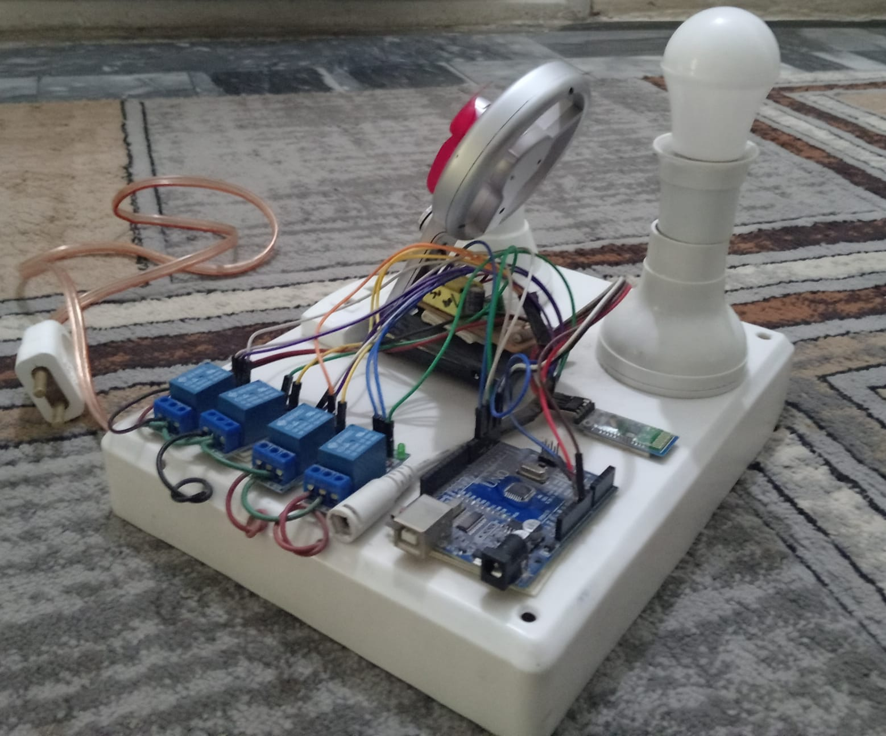

# 🏠 Home Automation System using ATmega328P & Bluetooth

## 📌 Overview
This project is an embedded home automation system designed to control household appliances wirelessly using Bluetooth communication. The system uses an ATmega328P microcontroller to receive commands from a mobile application and control multiple relays connected to electrical loads.

---

## 📁 Development Environment
- IDE: Atmel Studio 7.0  
- Microcontroller: ATmega328P  
- Language: Embedded C

---

## ⚙️ Features
- Bluetooth-based wireless control of appliances  
- UART communication at 9600 baud  
- Control of multiple devices using relay modules  
- Lightweight and efficient embedded C firmware  
- Real-time command-based switching  

---

## 🧠 System Architecture
The system follows a simple communication and control flow:

Android App → Bluetooth Module (HC-05) → UART (ATmega328P) → Relay Driver → Appliances

---

## 🛠️ Hardware Components
- ATmega328P (Arduino Uno platform)  
- HC-05 Bluetooth Module  
- 4-Channel Relay Module  
- Light Bulb (for demonstration)  
- Power supply and wiring  

---

## 💻 Firmware Implementation
The firmware was developed using Atmel Studio 7.0 in Embedded C.

Key implementation details:
- Direct register-level UART configuration (UCSR0x, UBRR0x)  
- Polling-based data reception using USART  
- Direct port manipulation (PORTB, DDRB) for relay control  
- Command-based switching logic  

---

## 🔌 Communication Protocol

| Command | Action |
|--------|--------|
| '1'    | Turn ON Relay 1 |
| '2'    | Turn ON Relay 2 |
| '3'    | Turn ON Relay 3 |
| '4'    | Turn ON Relay 4 |
| '0'    | Turn OFF all relays |

---

## 📸 Hardware Prototype



**Prototype Hardware Setup (ATmega328P + Relay Control + Bluetooth Interface)**  
Physical implementation of the system demonstrating real-time appliance control via Bluetooth.

---

## 📂 Repository Structure
```
├── firmware/              # Embedded C firmware
├── Image/                 # Project image
└── README.md
```


---

## 🚀 Future Improvements
- Replace ATmega328P with ESP32 for WiFi-based control  
- Develop IoT-based remote monitoring system  
- Add mobile app UI enhancements  
- Implement feedback/status monitoring for appliances  

---

